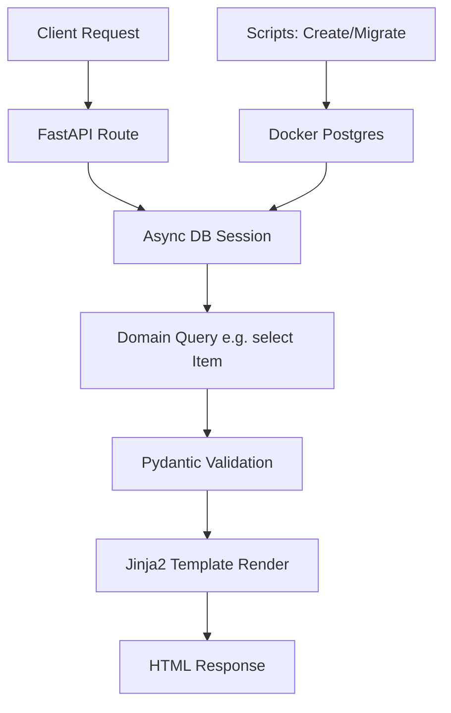

# Codebase Review: Nexus Attempt

## Aleph: Explanation of the Codebase

### 1. What is the Purpose of This Section?
The codebase for **Nexus Attempt** serves as the backend foundation for a personal knowledge management system. It is designed as a local-first application, emphasizing user control over data stored on their machine. Currently, it functions as a simple book catalog, indexing 449 books from a JSON dataset (`data.json`). The architecture is API-driven using FastAPI, with async PostgreSQL for data persistence via SQLAlchemy 2.0. It supports a web interface via Jinja2 templates for listing and viewing book details.

The broader purpose is to evolve into a comprehensive knowledge graph that connects various content types (books, bookmarks, notes, articles) through topics and relationships. Core philosophy: high-performance, offline-capable, and extensible. Key components include:
- **Database Schema**: Models for `Item` (content entities like books) and `Topic` (categories/tags) with many-to-many associations.
- **API Endpoints**: Basic CRUD (read-only for now) for items.
- **Setup Scripts**: For schema creation and data migration.
- **Docker Integration**: For easy PostgreSQL setup.

This section (the entire backend) establishes a scalable, async foundation for future features like search, multi-type support, and a Svelte frontend.

### 2. How Does It Work Step-by-Step?
The application follows a three-tier architecture: Presentation (FastAPI/Jinja2), Business (domain logic), Data (SQLAlchemy/PostgreSQL).

1. **Environment Setup**:
   - Copy `.env.example` to `.env` and set vars (though database.py uses `config.ini` from template `config_tempplate.ini`—note the typo).
   - Run `docker-compose up -d` to start PostgreSQL container (uses env vars for user/password/db).
   - Install deps: `pip install -r requirements.txt` (FastAPI, Uvicorn, SQLAlchemy[asyncio], asyncpg, etc.).

2. **Database Initialization**:
   - Run `python -m scripts.create_tables`: Connects via async engine (from `backend/database.py`), drops public schema, recreates it, and runs `Base.metadata.create_all` to build tables (`items`, `topics`, `item_topics` association).
   - Tables: `items` (id, uuid, title, source, item_type enum, attributes JSON, created_at); `topics` (id, name); many-to-many link.

3. **Data Migration**:
   - Run `python -m scripts.migrate_to_db`: Loads `data.json` (449 book entries with title, file_name), sorts by title, truncates tables, inserts as `Item` objects (type=BOOK, attributes={"format": "pdf"}, source=file_name). No topics inserted yet. Uses async session for batch insert and commit.

4. **Server Startup**:
   - Run `uvicorn backend.server:app --reload`: Starts FastAPI app on port 8000. Engine from `database.py` uses config.ini for DB URL (postgresql+asyncpg://...).

5. **Runtime Workflow**:
   - **Dependency Injection**: Routes use `Depends(get_db_session)` for async session yield.
   - **GET /**: Calls `fetch_all_items` (`backend/domain.py`): Async select with row_number() over title order, maps to `ItemSummary` Pydantic (uuid, display_index, title). Renders `book_list.html` with list.
   - **GET /books/{uuid}**: Calls `fetch_item_by_uuid`: Async select by UUID, validates to `ItemDetail` Pydantic (formats created_at). Renders `book_detail.html` or 404.
   - Data Flow: Request → Route → Domain func (async query) → Pydantic model → Template response.
   - API Docs: Auto at /docs (FastAPI Swagger).

6. **Access**: Web at http://127.0.0.1:8000 (lists books alphabetically); details by UUID.

### 3. Potential Issues or Limitations
- **Config Mismatch**: `database.py` reads `config.ini`, but template is `config_tempplate.ini` (typo). No auto-creation; user must rename/edit manually. Env vars in docker-compose not synced to config.
- **Hardcoded Assumptions**: Migration script hardcodes `ItemTypeEnum.BOOK` and `attributes={"format": "pdf"}`; no topic insertion despite schema support. data.json lacks UUIDs, so generated on insert (potential for duplicates if re-run without truncate).
- **No Error Handling in Scripts**: create_tables drops entire schema without confirmation; migrate assumes JSON structure without validation.
- **Scalability Limits**: No pagination in list endpoint (449 items ok now, but grows); full table scan for ordering. No indexing on title/uuid.
- **Frontend Placeholder**: Svelte setup but no integration; relies on basic Jinja2 (not dynamic).
- **No Auth/Security**: Open API; local-only assumed, but exposes data.
- **Async Gaps**: Domain queries are async, but scripts like migrate use sync-like patterns (asyncio.run).
- **Data Loss Risk**: Truncate in migrate; no backups.

## Be: Codebase Review

### 1. Code Quality and Adherence to Best Practices
- **Strengths**: Modern stack (FastAPI async, SQLAlchemy 2.0, Pydantic v2). Good separation: models, domain, server. Uses UUIDs for IDs (secure), enums for types, JSON for flexible attributes. Dependency injection for sessions.
- **Issues**: 
  - Inconsistent async: server/domain async, but scripts mix (migrate uses async session but sync loop).
  - No type hints in some places (e.g., scripts). requirements.txt has garbled comments (non-ASCII chars).
  - No tests; no linting enforced (though frontend has ESLint/Prettier placeholders).
  - Best Practices: Follows FastAPI docs, but lacks middleware (CORS, logging). No API versioning.

### 2. Potential Bugs or Edge Cases
- **Bugs**:
  - Config Path: `PROJECT_ROOT / 'config.ini'` assumes file exists; FileNotFoundError if not (no fallback to env vars).
  - Migration: Sorts data but inserts without UUID uniqueness check; if JSON has duplicates, violates unique constraint.
  - Domain: `fetch_all_items` uses row_number() but no partition; assumes single table. `scalar_one_or_none()` assumes one result, but if UUID collision, fails.
  - Templates: No escaping; assumes safe data, but user-generated titles could XSS (though local).
- **Edge Cases**:
  - Empty DB: List shows empty, but no handling for 0 items.
  - Invalid UUID: Route raises 404 correctly, but no custom error pages.
  - Large Data: 449 ok, but >10k items: memory issue in full fetch (no limit/offset).
  - DB Disconnect: No retry logic in engine.
  - Non-ASCII Titles: orjson handles, but sorting .lower() may fail on Unicode.

### 3. Performance Optimizations
- **Current**: Async I/O good for DB; row_number() efficient for small sets. Uvicorn/Gunicorn for prod.
- **Issues**: Full table fetch in list (O(n log n) sort); no indexes (add on title, uuid, created_at).
- **Suggestions**:
  - Add pagination: Query with `limit/offset`, add query params to route.
  - Indexing: In create_tables, add `CREATE INDEX idx_items_title ON items(title);`.
  - Caching: For static lists, use Redis or in-memory (but local-first, so minimal).
  - Batch Inserts: In migrate, use bulk_insert_mappings for speed.

### 4. Readability and Maintainability
- **Strengths**: Clean structure (per README), descriptive names, docstrings minimal but clear. Pydantic validators nice (date format).
- **Issues**: Magic numbers absent, but hardcoded paths (e.g., JSON_FILE). Scripts have sys.path hacks (import resolution). No comments in domain queries. Models lack __repr__.
- **Maintainability**: Modular, but growth needed: Add services layer. No CI/CD. Frontend skeleton unused.

### 5. Security Concerns
- **Strengths**: Local-only, no auth needed yet. UUIDs prevent enum attacks. Pydantic validates inputs.
- **Issues**:
  - Exposed DB: docker-compose binds 5432 to host; if networked, vulnerable (use localhost only).
  - No Input Sanitization: Titles/sources from JSON; if extended to user input, SQL injection risk (but ORM protects).
  - Config Exposure: .ini has plaintext password; gitignore it, but template shows placeholders.
  - Docker: Default image; no healthchecks, restart policy ok but no secrets management.
  - API: No rate limiting; /docs exposes schema.

## Suggestions for Improvements
1. **Fix Config Handling** [`backend/database.py`]: Use python-dotenv for .env, fallback from os.environ. Reason: Syncs with docker-compose; reduces manual steps. Add try/except for file read, default to env.
   
2. **Add Pagination to List Endpoint** [`backend/server.py`, `domain.py`]: Add `limit: int = 50, offset: int = 0` params, apply to query. Reason: Handles growth beyond 449 items; prevents slow loads/large responses.

3. **Implement Indexes and Constraints** [`scripts/create_tables.py`]: After create_all, execute `CREATE INDEX ...` and `ALTER TABLE items ADD CONSTRAINT unique_title UNIQUE(title);`. Reason: Speeds queries (title sort), prevents duplicates.

4. **Enhance Migration Script** [`scripts/migrate_to_db.py`]: Parse topics from JSON (if added), use bulk insert, add validation with Pydantic. Reason: Leverages schema fully; faster for large data; error-resilient.

5. **Add Error Handling and Logging** [All files]: Use FastAPI exceptions, loguru in routes/scripts. Reason: Graceful failures (e.g., DB connect error); debuggability.

6. **Secure Docker** [`docker-compose.yml`]: Bind ports "127.0.0.1:5432:5432", add healthcheck. Use docker secrets for password. Reason: Prevents external access; ensures container health.

7. **Add Basic Auth or API Keys** [`backend/server.py`]: If multi-user, add FastAPI security. Reason: Protects data if exposed; future-proofs.

8. **Write Tests** [New tests/ dir]: Pytest for unit (models, domain), integration (routes). Reason: Ensures reliability as features added; catches regressions.

9. **Integrate Frontend** [frontend/]: Build Svelte app consuming API, replace Jinja2. Reason: Dynamic UI for knowledge graph; aligns with roadmap.

10. **Add Search/Filter** [`domain.py`]: Full-text search with PostgreSQL ts_vector on title/source. Reason: Core for knowledge mgmt; improves usability.

This review provides a solid starting point. Implementing these will make the codebase more robust and scalable.